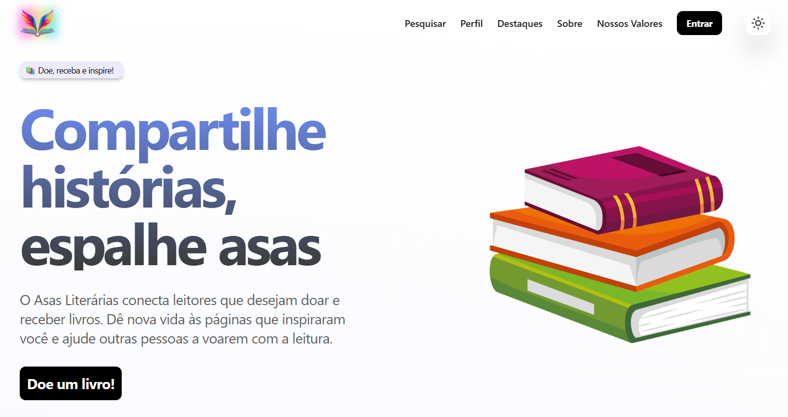

# 🎓 Projeto Asas Literárias

[](https://nextjs.org/)
[](https://react.dev/)
[](https://www.typescriptlang.org/)
[](https://tailwindcss.com/)
[](https://ui.shadcn.com/)
[](https://www.framer.com/motion/)
[](https://vercel.com/)
[](LICENSE)

**Asas Literárias** é uma plataforma dedicada a incentivar a leitura e a doação de livros. Nosso objetivo é conectar pessoas que desejam compartilhar histórias com quem busca conhecimento, dando nova vida às páginas e promovendo aprendizado e cultura para todos.

---

## 🚀 Tecnologias Utilizadas

- **Next.js**: Framework React para aplicações web otimizadas e com renderização híbrida.
- **React**: Biblioteca para construção de interfaces declarativas e reativas.
- **TypeScript**: Superset do JavaScript com tipagem estática.
- **Tailwind CSS**: Framework utilitário para estilização rápida e responsiva.
- **Shadcn/ui**: Conjunto moderno de componentes acessíveis e personalizáveis, construído com Tailwind CSS e Radix UI.
- **Framer Motion**: Biblioteca de animações para React, utilizada para transições suaves e interações visuais.
- **Vercel**: Plataforma de hospedagem e deploy contínuo.

---

## 🌓 Modo Escuro

O site possui suporte nativo ao **modo escuro**, adaptando-se automaticamente às preferências de tema do usuário. Isso proporciona uma experiência mais confortável em ambientes com pouca luz, além de contribuir para economia de energia em dispositivos com telas OLED.

---

## 🧑‍💻 Como Rodar Localmente

Clone o repositório e instale as dependências:

```bash
git clone https://github.com/seu-usuario/asas_literarias.git
cd study-project
npm install
```

Execute o servidor de desenvolvimento:

```bash
npm run dev
# ou
yarn dev
# ou
pnpm dev
# ou
bun dev
```

Abra o navegador e acesse [http://localhost:3000](http://localhost:3000).

---

## 📦 Deploy

O deploy é feito automaticamente via [Vercel](https://vercel.com/). Basta realizar o push para a branch principal que a aplicação será publicada.

---

## 📘 Licença

Este projeto está licenciado sob a licença MIT. Veja o arquivo [LICENSE](./LICENSE) para mais detalhes.

---

## 🤝 Contribuições

Contribuições são bem-vindas! Sugestões de funcionalidades ou melhorias no site, fique à vontade para abrir issues ou pull requests.

---

## 🌐 Demonstração

[Acesse o site em produção](https://asas-literarias.vercel.app) 🔗



---
